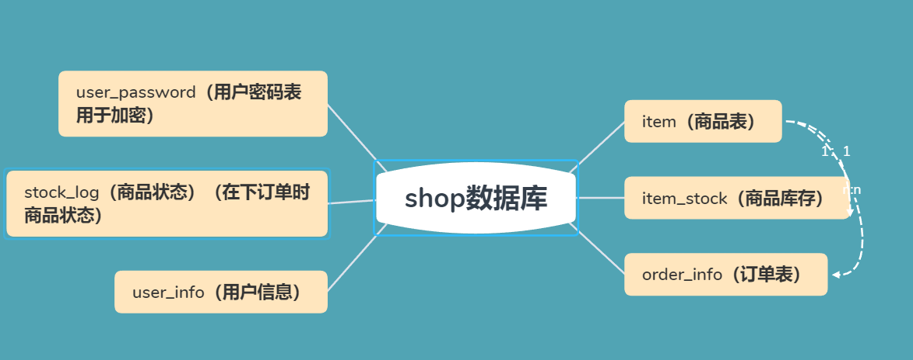

学习笔记：

SET NAMES utf8mb4;
SET FOREIGN_KEY_CHECKS = 0;

DROP TABLE IF EXISTS `item`;
**CREATE TABLE `item`**  (
  `id` int(11) NOT NULL AUTO_INCREMENT,
  `title` varchar(64) CHARACTER SET utf8 COLLATE utf8_general_ci NOT NULL DEFAULT '',
  `price` double(10, 0) NOT NULL DEFAULT 0,
  `description` varchar(500) CHARACTER SET utf8 COLLATE utf8_general_ci NOT NULL DEFAULT '',
  `sales` int(11) NOT NULL DEFAULT 0,
  `img_url` varchar(255) CHARACTER SET utf8 COLLATE utf8_general_ci NOT NULL DEFAULT '',
  PRIMARY KEY (`id`) USING BTREE
) ENGINE = InnoDB AUTO_INCREMENT = 9 CHARACTER SET = utf8 COLLATE = utf8_general_ci ROW_FORMAT = Dynamic;

SET FOREIGN_KEY_CHECKS = 1;

SET NAMES utf8mb4;
SET FOREIGN_KEY_CHECKS = 0;

DROP TABLE IF EXISTS `item_stock`;
**CREATE TABLE `item_stock`**  (
  `id` int(11) NOT NULL AUTO_INCREMENT,
  `stock` int(11) NOT NULL DEFAULT 0,
  `item_id` int(11) NOT NULL DEFAULT 0,
  PRIMARY KEY (`id`) USING BTREE,
  UNIQUE INDEX `item_id_index`(`item_id`) USING BTREE
) ENGINE = InnoDB AUTO_INCREMENT = 9 CHARACTER SET = utf8 COLLATE = utf8_general_ci ROW_FORMAT = Dynamic;

SET FOREIGN_KEY_CHECKS = 1;

SET NAMES utf8mb4;
SET FOREIGN_KEY_CHECKS = 0;

DROP TABLE IF EXISTS `order_info`;
**CREATE TABLE `order_info`**  (
  `id` varchar(32) CHARACTER SET utf8 COLLATE utf8_general_ci NOT NULL,
  `user_id` int(11) NOT NULL DEFAULT 0,
  `item_id` int(11) NOT NULL DEFAULT 0,
  `item_price` double NOT NULL DEFAULT 0,
  `amount` int(11) NOT NULL DEFAULT 0,
  `order_price` double NOT NULL DEFAULT 0,
  `promo_id` int(11) NOT NULL DEFAULT 0,
  PRIMARY KEY (`id`) USING BTREE
) ENGINE = InnoDB CHARACTER SET = utf8 COLLATE = utf8_general_ci ROW_FORMAT = Dynamic;

SET FOREIGN_KEY_CHECKS = 1;

SET NAMES utf8mb4;
SET FOREIGN_KEY_CHECKS = 0;

DROP TABLE IF EXISTS `stock_log`;
**CREATE TABLE `stock_log`**  (
  `stock_log_id` varchar(64) CHARACTER SET utf8 COLLATE utf8_general_ci NOT NULL,
  `item_id` int(11) NOT NULL DEFAULT 0,
  `amount` int(11) NOT NULL DEFAULT 0,
  `status` int(11) NOT NULL DEFAULT 0 COMMENT '//1表示初始状态，2表示下单扣减库存成功，3表示下单回滚',
  PRIMARY KEY (`stock_log_id`) USING BTREE
) ENGINE = InnoDB CHARACTER SET = utf8 COLLATE = utf8_general_ci ROW_FORMAT = Dynamic;

SET FOREIGN_KEY_CHECKS = 1;

SET NAMES utf8mb4;
SET FOREIGN_KEY_CHECKS = 0;

DROP TABLE IF EXISTS `user_info`;
**CREATE TABLE `user_info`**  (
  `id` int(11) NOT NULL AUTO_INCREMENT,
  `name` varchar(64) CHARACTER SET utf8 COLLATE utf8_general_ci NOT NULL DEFAULT '',
  `gender` tinyint(4) NOT NULL DEFAULT 0 COMMENT '//1代表男性，2代表女性',
  `age` int(11) NOT NULL DEFAULT 0,
  `telphone` varchar(255) CHARACTER SET utf8 COLLATE utf8_general_ci NOT NULL DEFAULT '',
  `register_mode` varchar(255) CHARACTER SET utf8 COLLATE utf8_general_ci NOT NULL DEFAULT '' COMMENT '//byphone,bywechat,byalipay',
  `third_party_id` varchar(64) CHARACTER SET utf8 COLLATE utf8_general_ci NOT NULL DEFAULT '',
  PRIMARY KEY (`id`) USING BTREE,
  UNIQUE INDEX `telphone_unique_index`(`telphone`) USING BTREE
) ENGINE = InnoDB AUTO_INCREMENT = 29 CHARACTER SET = utf8 COLLATE = utf8_general_ci ROW_FORMAT = Dynamic;

SET FOREIGN_KEY_CHECKS = 1;

SET NAMES utf8mb4;
SET FOREIGN_KEY_CHECKS = 0;

-- ----------------------------

DROP TABLE IF EXISTS `user_password`;
**CREATE TABLE `user_password`**  (
  `id` int(11) NOT NULL AUTO_INCREMENT,
  `encrpt_password` varchar(128) CHARACTER SET utf8 COLLATE utf8_general_ci NOT NULL DEFAULT '',
  `user_id` int(11) NOT NULL DEFAULT 0,
  PRIMARY KEY (`id`) USING BTREE
) ENGINE = InnoDB AUTO_INCREMENT = 19 CHARACTER SET = utf8 COLLATE = utf8_general_ci ROW_FORMAT = Dynamic;

SET FOREIGN_KEY_CHECKS = 1;

